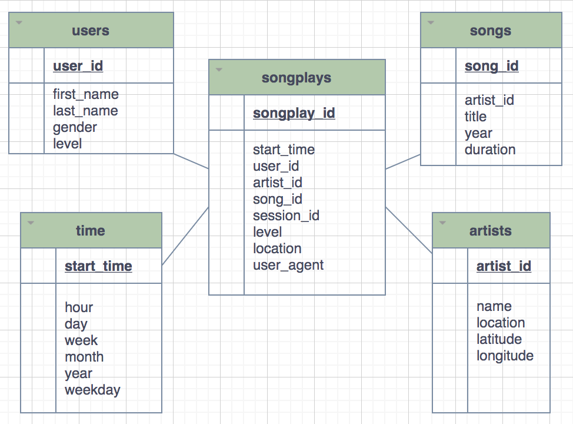

# Overview 
A startup company wants to analyze the data they've been collecting on songs and user activity on their new music streaming app especilly interested in understanding what songs users are listening to. Currently, they have a directory of JSON logs on user activity on the app, as well as a directory with JSON metadata on the songs in their app.

This project is to create a Postgres database with tables designed to optimize queries on song play analysis from json files. First, create a database schema with Postgres  to define fact and dimension tables for a star schema for a particular analytic focus. Second , build an ETL pipeline using Python that transfers data from json files in two local directories into these tables in Postgres using Python and SQL.

## Dataset
There two sets of data: Song Dataset and Log Dataset.
### Song Dataset
The first dataset is a subset of real data from Song Dataset. Each file is written in JSON format and contains metadata about a song and the artist of that song. The files are partitioned by the first three letters of each song's track ID. For example, here are filepaths to two files in this dataset.

song_data/A/B/C/TRABCEI128F424C983.json
song_data/A/A/B/TRAABJL12903CDCF1A.json

 a single song file, TRAABJL12903CDCF1A.json, looks like.
``code
    {"num_songs": 1, "artist_id": "ARJIE2Y1187B994AB7", "artist_latitude": null, "artist_longitude": null, "artist_location": "", "artist_name": "Line Renaud", "song_id": "SOUPIRU12A6D4FA1E1", "title": "Der Kleine Dompfaff", "duration": 152.92036, "year": 0}
``

### Log Dataset
The second dataset consists of log files in JSON format generated by an event simulator based on the songs in the dataset above. These simulate activity logs from a music streaming app based on specified configurations.
The log files in the dataset are partitioned by year and month. For example, here are filepaths to two files in this dataset.
``code
log_data/2018/11/2018-11-12-events.json
log_data/2018/11/2018-11-13-events.json
``code
### Python script 
* create_tables.py 
    * contains Python script that connects to Postgres database using “psycopg2” Python Postgres module and drops database, creates database, drops tables, and creates tables. SQL code is imported from “sql_queries.py” file. 
* test.ipynb 
    * displays the first few rows of each table to check the database.
* etl.ipynb 
    * reads and processes a single file from song_data and log_data and loads the data into your tables. This notebook contains detailed instructions on the ETL process for each of the tables.
* etl.py 
    * reads and processes files from song_data and log_data and loads them into tables.This program aligns with the ETL notebook above.contains Python script that processes data from JSON formatted files stored on local drives and insert them into respective tables. Python modules 'os' and “glob” are used to interact with the operating system where the data files are stored. Pandas module is used to efficiently read and parse JSON files. INSERT statements are imported from “sql_queries.py” file
* sql_queries.py 
    * contains SQL code for Create table statement, Drop table statement, Insert statement, and Select query for Songs Play table and imported in the above files.
* README.md 
    * provides explanation of project.

#### create_tables.py 
The script connects to the sparkify database, drops any tables if they exist, and creates the tables.
``code
    # connect to default database
    conn = psycopg2.connect("host=127.0.0.1 dbname=studentdb user=student password=student")
    conn.set_session(autocommit=True)
    cur = conn.cursor()
    
    # create sparkify database with UTF8 encoding
    cur.execute("DROP DATABASE IF EXISTS sparkifydb")
    cur.execute("CREATE DATABASE sparkifydb WITH ENCODING 'utf8' TEMPLATE template0")
``
#### Database Schema Design
Using the song and log datasets, created a star schema (Fact and dimensional tables for a star schema ) optimized for queries on song play analysis. CREATE statements in sql_queries.py specify all columns for each of the five tables with the right data types and conditions.
1. Fact Table
    * songplays - records in log data associated with song plays i.e. records with page NextSong
        * songplay_id, start_time, user_id, level, song_id, artist_id, session_id, location, user_agent
2. Dimension Tables
    * users - users in the app
        * user_id, first_name, last_name, gender, level
    * songs - songs in music database
        * song_id, title, artist_id, year, duration
    * artists - artists in music database
        * artist_id, name, location, latitude, longitude
    * time - timestamps of records in songplays broken down into specific units
        * start_time, hour, day, week, month, year, weekday

* Defining PRIMARY KEYs for the tables
* Added NOT NULL  clause for important column, specially the dimension column on the fact table.(e.g. timestamp, user_id on songplay table)
* Using SERIAL data type for the songplay_id column.
* Check ON CONFLICT: e.g. The level of a user is being modified upon any UPDATE request which will ensure when a user changes the subscription paid of free it correctly gets updated. Rest are just ignored as most of the others are static data, which are very unlikely to change.
### ETL
The script, etl.py, connects to the Sparkify database, extracts and processes the log_data and song_data, and loads data into the five tables. Since this is a subset of the much larger dataset, the solution dataset will only have 1 row with values for value containing ID for both songid and artistid in the fact table. Those are the only 2 values that the query in the sql_queries.py will return that are not-NONE. The rest of the rows will have NONE values for those two attributes.

INSERT statements are for each table, and handle existing records where appropriate. songs and artists tables are used to retrieve the information for the songplays INSERT.

etl.ipynb notebook is built to develop ETL processes for each table. With running test.ipynb I can check that records were successfully inserted into each table. 

### Data processing using Pandas 
To read JSON data within log_data files, a pandas dataframe is created to read the data. First import JSON and pandas libraries.
``code
import pandas as pd
df = pd.read_json('data/log_data/2018/11/2018-11-01-events.json', lines=True) ``
This would read the data file 2018-11-01-events.json.

### Insturction
1. Run create_tables.py to create database and tables.
2. Run test.ipynb to confirm the creation of tables with the correct columns. Make sure to click "Restart kernel" to close the connection to the database after running this notebook.
3. Run etl.ipynb 

### summary
The project goal was to build a Postgres schema with the tables designed to optimize queries on song play analysis. Songs and User activity data are collected in the startup company, Sparkify’s music streaming app. Data is stored in JSON format and not easily available for analysis. As part of the solution, a five table(one fact table and four dimensional tables) Star schema was defined and built an ETL pipeline to transfer data from Songs and User activity files stored in the local directories to the tables. Utilized multiple Python modules to extract the data on local directories, transform them and load them to Postgres.
